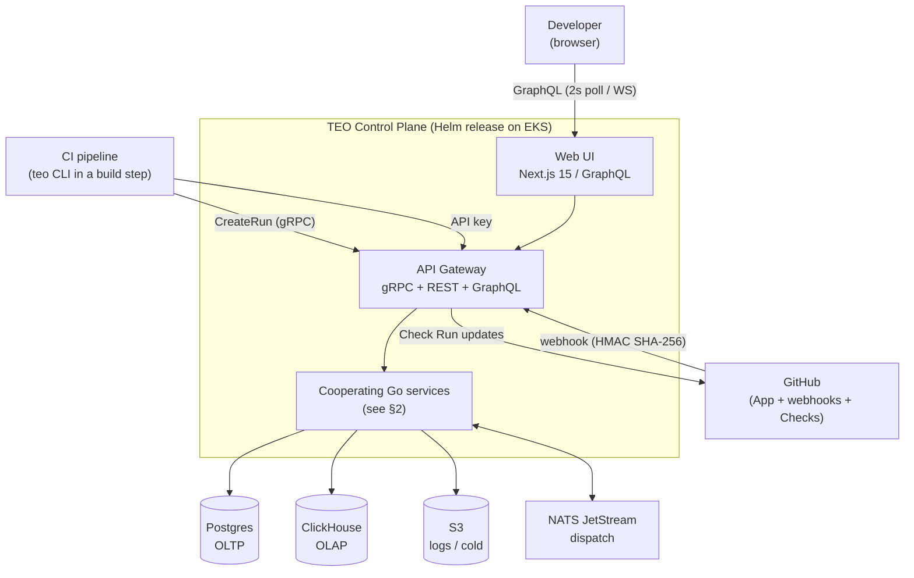
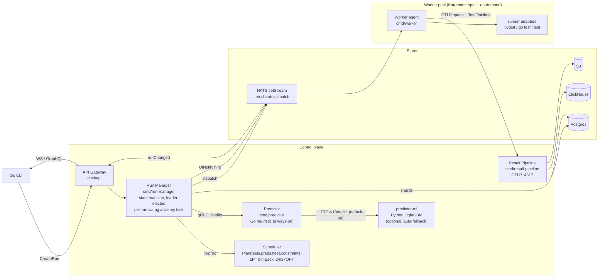
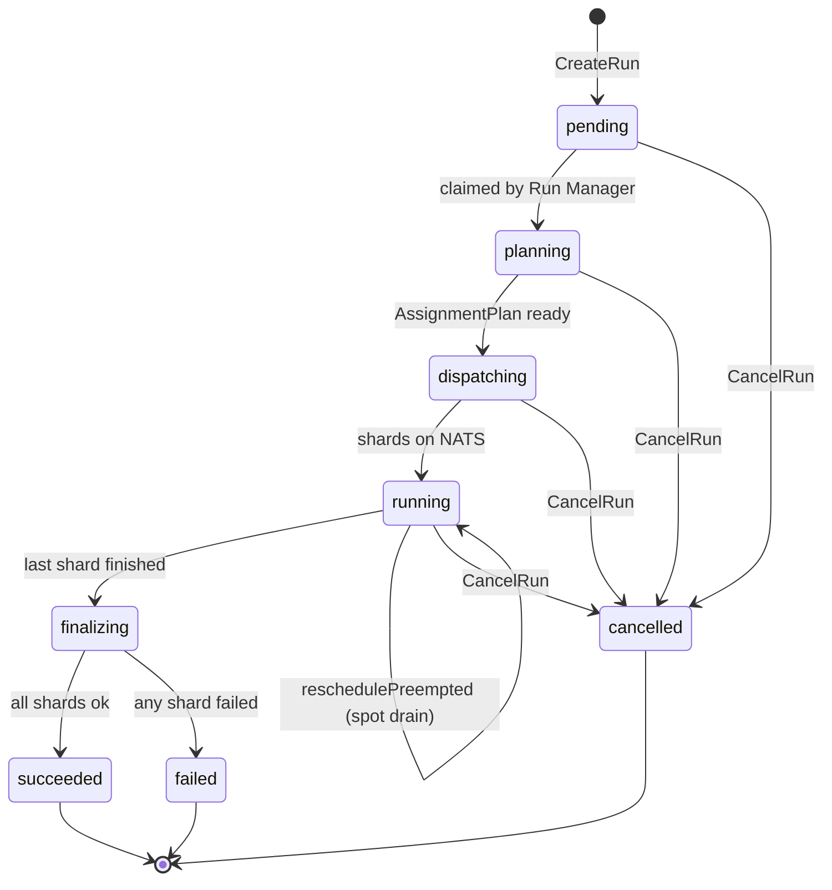
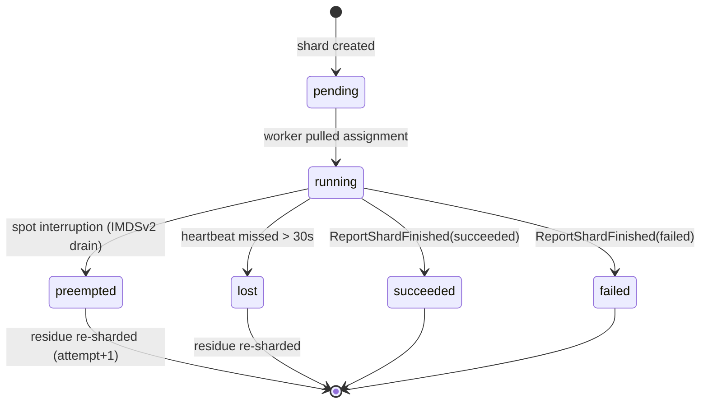
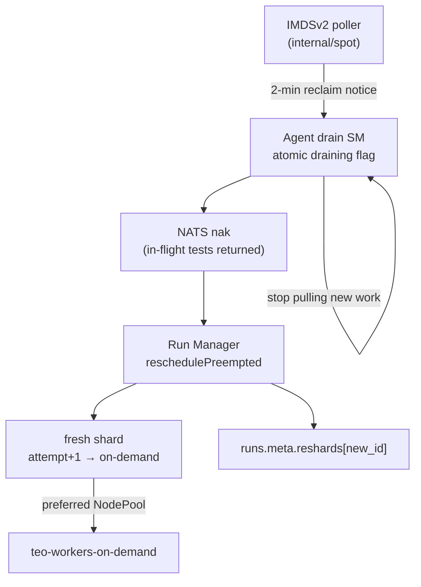
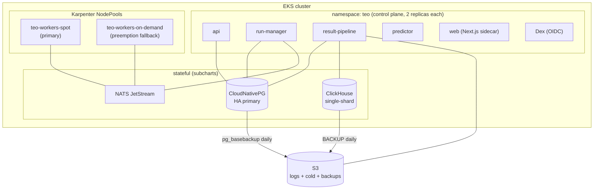

# TEO — Architecture Diagrams

**Status:** Current (reflects code at `main`, v1.0.0 shipped + v1.1 WebSocket subs)
**Audience:** Engineers, reviewers, new contributors
**Companion docs:** [`overview.md`](overview.md) (the spec / "should"), [`schema.md`](schema.md) (datastores), [`er-diagram.md`](er-diagram.md) (Postgres relationships), [`../../progress.md`](../../progress.md) (what's wired up — ground truth)

All diagrams are [Mermaid](https://mermaid.js.org/); GitHub, VS Code, and most IDEs render them inline. This file is descriptive of the **as-built** system, not aspirational. When it disagrees with `progress.md`, trust `progress.md` for code.

---

## 1. System context

Who talks to TEO and what it persists to. TEO is **single-tenant, AWS-only** — there are no `tenant_id` columns anywhere.



---

## 2. Service fan-out (containers / processes)

Seven Go binaries (`cmd/{teo,api,run-manager,scheduler,result-pipeline,predictor,worker}`) plus the optional Python ML predictor. The scheduler is a **pure function** invoked in-process by the Run Manager (it is a binary for replay/testing, not a long-running service in the hot path).



**Key contracts** (`proto/teov1/`):
- `Runs` service — `CreateRun`, `GetRun`, `CancelRun` (CLI/API → Run Manager).
- `Workers` service — `Register`, `Heartbeat`, `PullAssignment`, `ReportTestFinished`, `ReportShardFinished` (worker ↔ control plane).

---

## 3. Run lifecycle (sequence)

The happy path of a single run, from CI invocation to terminal status.

```mermaid
sequenceDiagram
    autonumber
    participant CLI as teo CLI
    participant API as API Gateway
    participant RM as Run Manager
    participant PR as Predictor
    participant SC as Scheduler
    participant NA as NATS
    participant WK as Worker
    participant RP as Result Pipeline
    participant PG as Postgres
    participant CH as ClickHouse

    CLI->>API: CreateRun(manifest, commit, branch, idempotency_key)
    API->>PG: INSERT run (status=pending)
    API-->>CLI: Run{id, status=pending}
    RM->>PG: claim run (advisory lock), status=planning
    RM->>PR: Predict(fingerprints) → {p50,p95,flake_prob}
    RM->>SC: Plan(tests, predictions, fleet, constraints)
    SC-->>RM: AssignmentPlan (JSON, replayable)
    RM->>PG: INSERT shards, run_plans; status=dispatching
    RM->>NA: publish teo.shards.dispatch
    WK->>NA: PullAssignment
    NA-->>WK: Assignment{shard_id, tests}
    RM->>PG: status=running
    loop per test
        WK->>WK: run via adapter (pytest/gotest/jest)
        WK->>RP: OTLP spans + ReportTestFinished
        RP->>PG: INSERT test_executions
        RP->>CH: INSERT test_runs + span_events
    end
    WK->>RP: ReportShardFinished(status)
    RM->>RM: last shard? → finalize
    RM->>PG: failure clustering, flake detection
    RM->>API: UINotify hint (teo.ui.run_changed)
    RM->>PG: status=succeeded|failed
    API-->>CLI: terminal status
```

---

## 4. Run state machine

Driven by the Run Manager (`internal/runmanager`), persisted to `teo.runs.status`. Each transition is committed under a per-run `pg_try_advisory_xact_lock` so only one Run Manager replica drives a given run (ADR-0013).



Valid statuses (CHECK constraint on `teo.runs.status`): `pending, planning, dispatching, running, finalizing, succeeded, failed, cancelled`.

## 4b. Shard state machine

`teo.shards.status` — note `preempted` and `lost`, which feed the reschedule sweep.



When a shard goes `preempted`/`lost`, the Run Manager's `reschedulePreempted` sweep recomputes the residue and creates a fresh shard, recording it under `runs.meta.reshards[<new_shard_id>]`.

---

## 5. Spot-interruption drain flow

How a Spot reclaim is turned into a clean reschedule rather than lost work (`internal/spot/`, `internal/worker/drain`).



---

## 6. Deployment topology

One Helm umbrella chart (`deploy/helm/teo/`) on EKS. Control-plane services run 2 replicas; workers are Karpenter-provisioned across two NodePools.



---

## 7. How to keep these current

- These diagrams describe **wired-up behavior**. A behavior-changing PR that alters a state, a service boundary, or a contract should update the relevant diagram in the same commit (same rule as `progress.md`).
- Diagram source is plain Mermaid in this Markdown file — edit it directly; no build step.
- The authoritative status of any epic/FR is always [`progress.md`](../../progress.md); the *spec* intent is [`overview.md`](overview.md).
