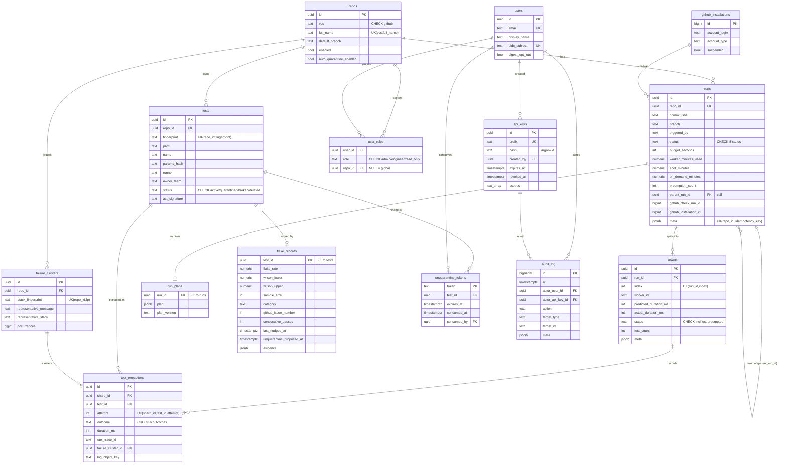

# TEO — Entity-Relationship Diagram (Postgres)

**Status:** Current — matches `migrations/postgres/001..006`.
**Companion:** [`schema.md`](schema.md) (column-level detail + ClickHouse + S3).

This is the **Postgres** (`teo` schema) relational model. ClickHouse tables (`test_runs`, `span_events`, `flake_observations`, `mv_run_summary`) are analytical and have **no foreign keys** — they join to these entities by id at query time, so they are intentionally omitted here (see [`schema.md` §2](schema.md)).

Crow's-foot notation: `||--o{` = one-to-many (optional child), `||--o|` = one-to-zero-or-one. `PK` = primary key, `FK` = foreign key, `UK` = unique.

## Reading notes

- **`test_executions` is the hub.** It is the only table that joins the *physical* execution lineage (`run → shard`) to the *logical* test identity (`tests`), and optionally to a `failure_clusters` row. One row per `(shard, test, attempt)`.
- **`runs.parent_run_id`** is a self-reference capturing rerun lineage (e.g. "rerun failed tests" creates a child run).
- **`user_roles`** has no single-column PK — uniqueness is enforced by two *partial* unique indexes (global rows where `repo_id IS NULL`, and per-repo rows otherwise). The crow's-foot links are still `users`/`repos` FKs.
- **`github_installations ⇢ runs`** is drawn as a relationship for clarity, but it is a **soft link by value** (`runs.github_installation_id BIGINT`), not a declared FK constraint.
- **Idempotency**: `runs` carries no dedicated column — the idempotency key lives in `meta->>'idempotency_key'` with a partial unique index (migration 005).
